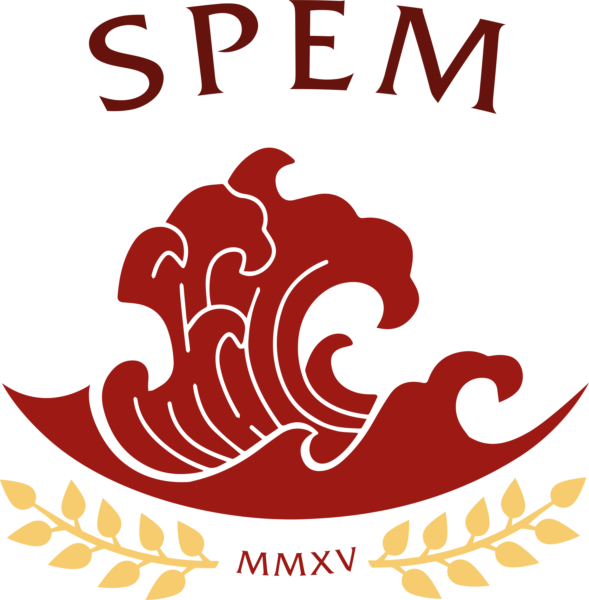
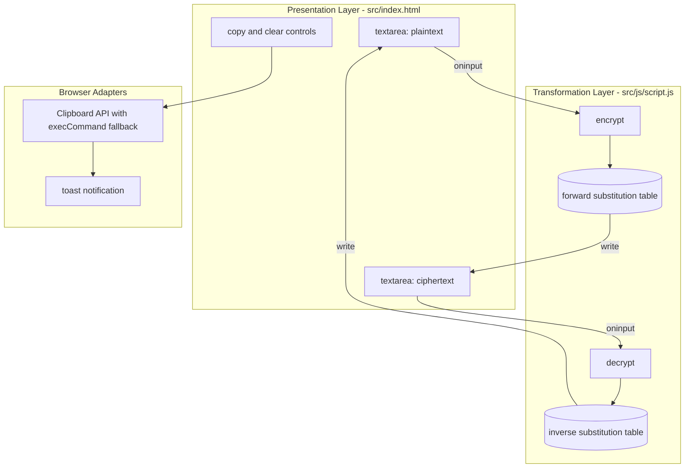
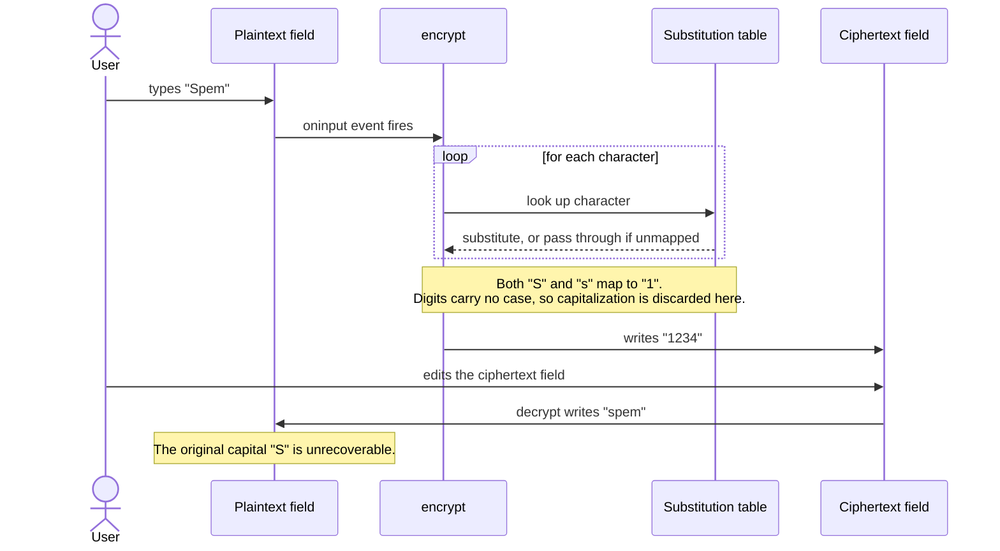

# SpemTraductor

<div align="center">



[](https://github.com/13rianVargas/SpemTraductor/stargazers)

[](https://spem-traductor.vercel.app)
[](LICENSE)
[](https://developer.mozilla.org/en-US/docs/Web/HTML)
[](https://developer.mozilla.org/en-US/docs/Web/CSS)
[](https://developer.mozilla.org/en-US/docs/Web/JavaScript)
[](#tech-stack)

**A zero-dependency, zero-build client-side implementation of the SpemCode substitution cipher.**

[Live Demo](https://spem-traductor.vercel.app) · [Report a Bug](https://github.com/13rianVargas/SpemTraductor/issues) · [Request a Feature](https://github.com/13rianVargas/SpemTraductor/issues)

</div>

---

## Table of Contents

- [Executive Summary](#executive-summary)
- [Security Notice](#security-notice)
- [Key Features](#key-features)
- [System Architecture](#system-architecture)
- [The SpemCode Cipher](#the-spemcode-cipher)
- [Tech Stack](#tech-stack)
- [Getting Started](#getting-started)
- [Deployment](#deployment)
- [Project Structure](#project-structure)
- [Improvement Backlog](#improvement-backlog)
- [Contributing](#contributing)
- [License](#license)
- [Copyright](#copyright)
- [Author](#author)

---

## Executive Summary

SpemTraductor is a browser-resident text transformation tool that implements **SpemCode**, a monoalphabetic substitution cipher defined over a 30-symbol alphabet (`a`-`z` plus the digits `1`-`4`).

It was built for **Clan SPEM**, the senior youth section of **Grupo Scout 74** in Bogota, Colombia. Scouting has a long tradition of ciphers and secret codes as part of patrol craft, and SpemCode continues it: the clan uses it for internal messaging, games, and trail markers. This tool replaces the pencil-and-paper lookup with something the members can use from a phone.

The system is intentionally minimal. It has no backend, no build pipeline, no package manager, and no runtime dependencies: the deployed artifact is the source. Every transformation happens synchronously in the browser against an in-memory lookup table, and no input ever leaves the client.

The interface is bidirectional by design. Both text fields are simultaneously input and output — typing in either one drives the transformation in the opposite direction, so encoding and decoding are the same interaction rather than two separate modes.

---

## Security Notice

**SpemCode is a substitution cipher, not cryptography.** This distinction is not pedantic:

- The full substitution table is published in this README and readable in the client source.
- Monoalphabetic substitution preserves letter frequency and word structure, so it falls to elementary frequency analysis.
- There is no key, no salt, and no secret material of any kind.

SpemTraductor provides **obfuscation, not confidentiality**. Do not use it to protect passwords, credentials, personal data, or anything else whose disclosure would cause harm. Its purpose is community flavor and recreational encoding.

---

## Key Features

- **Real-time bidirectional transformation.** Both textareas bind to `oninput`; the counterpart field updates on every keystroke, with no submit action and no debounce needed at this input scale.
- **Symmetric interaction model.** Neither field is privileged. Encoding and decoding are the same operation applied through inverse tables, so there is no mode to toggle and no state to track.
- **Resilient clipboard integration.** Uses the asynchronous Clipboard API when available, and falls back to `document.execCommand('copy')` with an explicit selection-range cleanup for non-secure contexts and older browsers (`src/js/script.js:100-127`).
- **Lazily constructed toast notifications.** The toast element is created on first use and reused thereafter, with a forced reflow (`void element.offsetWidth`) to restart the CSS animation on repeated triggers (`src/js/script.js:157-165`).
- **Responsive layout driven by custom properties.** The entire palette and elevation scale are declared as CSS variables in a single `:root` block (`src/css/style.css:2-16`), keeping theming centralized.
- **Graceful pass-through.** Characters outside the cipher alphabet — spaces, punctuation, accented characters, and the digits `0` and `5`-`9` — are emitted unchanged rather than dropped, so message formatting survives a round trip.
- **Zero supply chain.** No dependencies means no transitive packages, no lockfile drift, and nothing to audit beyond the three source files in this repository.

---

## System Architecture

The application is a three-layer client-side pipeline with no persistence and no network I/O. DOM events drive pure lookup functions, which write results back to the DOM.



The sequence below traces a single encode and shows precisely where information is lost, which is the one behavior worth understanding before relying on the tool.



---

## The SpemCode Cipher

SpemCode is not an arbitrary lookup table. It is generated by three composable rules over a 30-symbol alphabet:

1. **Vowels `a`, `i`, `o`, `u` are invariant.** They map to themselves.
2. **Four symbols are swapped with digits:** `e` to `3`, `m` to `4`, `p` to `2`, `s` to `1`. These four letters are removed from the consonant chain, and the digits map back to them.
3. **Every remaining consonant advances to the next available consonant**, skipping the three extracted in rule 2, and wrapping from `z` back to `b`.

Rule 3 is why the table looks irregular at a glance: `l` maps to `n` because `m` was extracted, `n` maps to `q` because `p` was extracted, and `r` maps to `t` because `s` was extracted.

### Substitution Table

Read it vertically: each cipher symbol sits directly under the character it replaces.

| **Plain**  |  a  |  b  |  c  |  d  |   e   |  f  |  g  |  h  |  i  |  j  |  k  |  l  |   m   |
| :--------- | :-: | :-: | :-: | :-: | :---: | :-: | :-: | :-: | :-: | :-: | :-: | :-: | :---: |
| **Cipher** |  a  |  c  |  d  |  f  | **3** |  g  |  h  |  j  |  i  |  k  |  l  |  n  | **4** |

| **Plain**  |  n  |  o  |   p   |  q  |  r  |   s   |  t  |  u  |  v  |  w  |  x  |  y  |  z  |
| :--------- | :-: | :-: | :---: | :-: | :-: | :---: | :-: | :-: | :-: | :-: | :-: | :-: | :-: |
| **Cipher** |  q  |  o  | **2** |  r  |  t  | **1** |  v  |  u  |  w  |  x  |  y  |  z  |  b  |

| **Plain**  |  1  |  2  |  3  |  4  |
| :--------- | :-: | :-: | :-: | :-: |
| **Cipher** |  s  |  p  |  e  |  m  |

The bold cells are the four letter-to-digit swaps (`s`, `p`, `e`, `m`), the ones responsible for the case limitation described below. The columns where plain and cipher match are the invariant vowels `a`, `i`, `o`, `u`.

Uppercase letters map to the uppercase of their substitute. Every other character — spaces, punctuation, accented characters, and the digits `0` and `5`-`9` — passes through untouched.

### Worked Example

```text
Plain    E  j  e  m  p  l  o  :     C  l  a  n     S  p  e  m
Cipher   3  k  3  4  2  n  o  :     D  n  a  q     1  2  3  4
```

`Ejemplo: Clan Spem` encodes to `3k342no: Dnaq 1234`.

### Known Limitations

**The cipher is not bijective with respect to case.** Because `e`, `m`, `p`, and `s` map to digits, and digits have no uppercase form, the mapping is many-to-one for those four letters:

```
"Spem"  -->  encode  -->  "1234"  -->  decode  -->  "spem"
```

The capital `S` is unrecoverable. This is inherent to a design that substitutes letters with digits, not an implementation defect, and it affects only these four letters. It is documented rather than fixed because correcting it would change the cipher and invalidate every message the community has already encoded.

**Non-Latin input is unaffected.** Accented characters such as `á` and `ñ` are not in the alphabet and pass through as-is, which makes Spanish ciphertext partially legible.

---

## Tech Stack

| Technology                | Architectural Role                                                                                                                           |
| ------------------------- | -------------------------------------------------------------------------------------------------------------------------------------------- |
| **HTML5**                 | Semantic document structure. Native `<label>`/`<textarea>` association supplies accessibility without ARIA scaffolding.                      |
| **CSS3**                  | Presentation layer. Custom properties centralize the design tokens; flexbox drives the responsive layout with no framework.                  |
| **Vanilla JavaScript**    | Transformation layer. Plain object literals serve as O(1) lookup tables; no classes, no modules, no transpilation.                           |
| **Google Fonts (Lexend)** | The single external resource, loaded via `<link>`. Lexend is optimized for reading proficiency, which suits a text-transformation interface. |
| **Vercel**                | Static hosting and CI. Every push to `main` triggers an automatic deploy; no build command runs because there is nothing to build.           |

The absence of a bundler, package manager, and framework is a deliberate constraint, not a gap. It keeps the deployed artifact byte-identical to the source, eliminates the supply chain entirely, and makes the project readable end to end by someone learning front-end fundamentals.

---

## Getting Started

```bash
git clone https://github.com/13rianVargas/SpemTraductor.git
cd SpemTraductor
```

Open the application directly — no install, no build:

```bash
open src/index.html
```

The `file://` protocol works because the project uses no ES modules and therefore triggers no CORS restrictions. If you prefer a local server:

```bash
python3 -m http.server 8000
```

Then visit `http://localhost:8000/src/index.html`.

---

## Deployment

The project is deployed on Vercel with **Root Directory set to `src`** in the project settings. Two consequences are worth knowing before forking:

- The deployed site root maps to `src/index.html`. Requesting `/src/index.html` on the live domain returns 404.
- Only files under `src/` are served. `portfolio-cover.png` at the repository root exists for documentation and portfolio use; the copy under `src/assets/img/` is the one the Open Graph tags reference.

Root Directory is a dashboard-level setting and **cannot** be expressed in `vercel.json`, because Vercel resolves that file from inside the configured root. A `vercel.json` placed at the repository root would be silently ignored.

---

## Project Structure

```text
SpemTraductor/
├── README.md                       # This document
├── CONTRIBUTING.md                 # Contribution workflow and constraints
├── AGENTS.md                       # Operational context for AI coding agents
├── LICENSE                         # Proprietary, Clan SPEM members only
├── .gitignore
├── portfolio-cover.png             # 1200x630 social and portfolio card
└── src/                            # Vercel Root Directory
    ├── index.html                  # Single page; markup and event bindings
    ├── css/
    │   └── style.css               # Design tokens, layout, responsive rules
    ├── js/
    │   └── script.js               # Cipher tables, clipboard adapter, toast
    └── assets/
        └── img/
            ├── SPEM-Emblem.png     # Clan emblem
            ├── SPEM-Shield.png     # Clan shield, used in the header
            ├── favicon.png         # 96x96 icon derived from the shield
            └── portfolio-cover.png # Served copy for Open Graph metadata
```

---

## Improvement Backlog

Known technical debt, tracked openly rather than hidden:

- **Single source of truth for the substitution table.** `src/js/script.js` currently maintains two hand-written mirror dictionaries, one per direction. They must be edited in lockstep, which is a drift hazard. The forward table should be the sole declaration, with the inverse derived programmatically at load time.
- **Separate the cipher domain from the DOM.** `encrypt` and `decrypt` currently read from and write to the DOM directly, so the cipher cannot be exercised without a document. Extracting pure `encode(text)` and `decode(text)` functions would make the logic independently testable and reusable.
- **Replace inline event handlers.** `oninput` and `onclick` attributes in the markup couple structure to behavior. Registering listeners with `addEventListener` would restore that separation.
- **Optimize image assets.** `SPEM-Shield.png` weighs 1.4 MB, which dominates the page's transfer size on a project that otherwise ships a few kilobytes of code.
- **Accessibility pass.** The toast has no `aria-live` region, so status messages are not announced to screen readers.

Any of these that require splitting `script.js` into multiple files must resolve a real tradeoff first: native ES modules are blocked by CORS under `file://`, which would break the documented double-click workflow. A revealing-module pattern inside the existing single file avoids that cost.

---

## Contributing

**Code contributions are restricted to members of Clan SPEM**, in line with the license. If you are a member, read [CONTRIBUTING.md](CONTRIBUTING.md) — it covers the local setup, the commit convention, and the two hard constraints (zero dependencies, zero build step) that any pull request must respect.

Anyone is welcome to open an [issue](https://github.com/13rianVargas/SpemTraductor/issues) to report a bug or discuss the implementation. Reading the code and learning from it is exactly why it is published.

---

## License

This project is **not open source**. It is distributed under the SpemTraductor Community License: use and modification are granted only to members of Clan SPEM, Grupo Scout 74. See [LICENSE](LICENSE) for the full terms.

The source is published for transparency, portfolio, and educational review. GitHub's Terms of Service allow any user to view and fork public repositories; the license does not attempt to override that, but forking grants no right to use, deploy, or redistribute the Software.

---

## Copyright

Copyright in this work arises automatically upon creation under the Berne Convention and Colombian law (Law 23 of 1982, Decision Andina 351 of 1993). No registration is required for it to hold.

- **Software** — source code, documentation, and architecture: copyright 13rian Vargas.
- **Visual identity** — the SPEM emblem, shield, and the names SPEM and Clan SPEM: property of Clan SPEM, Grupo Scout 74, Bogota, Colombia.

---

## Author

**13rian Vargas**

[](https://linktr.ee/13rianVargas)
[](https://github.com/13rianVargas)

Built for **Clan SPEM**, Grupo Scout 74, Bogota — whose members shaped the cipher and the tool around it.
